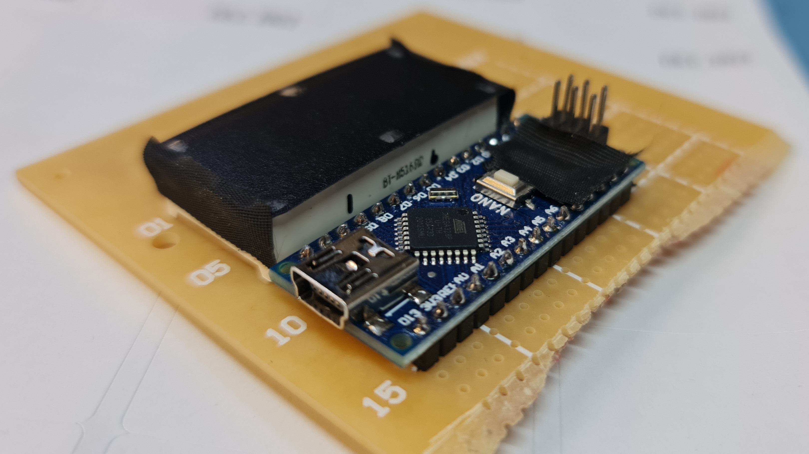
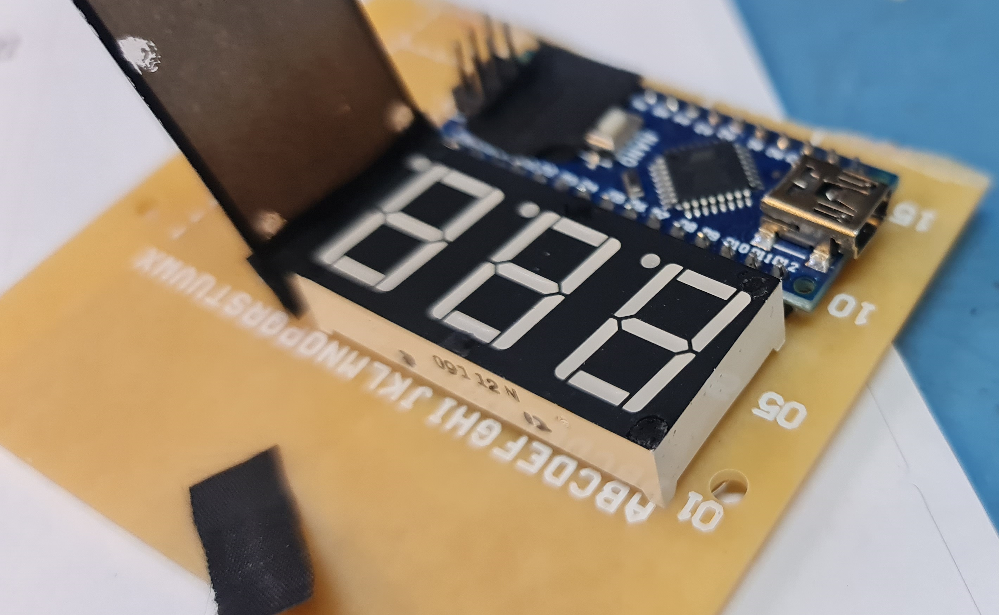
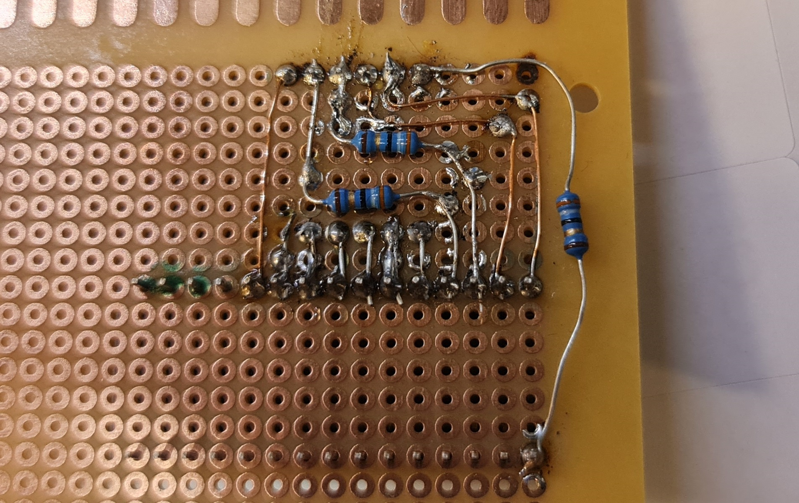
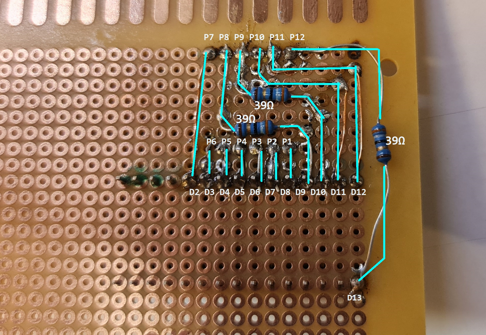
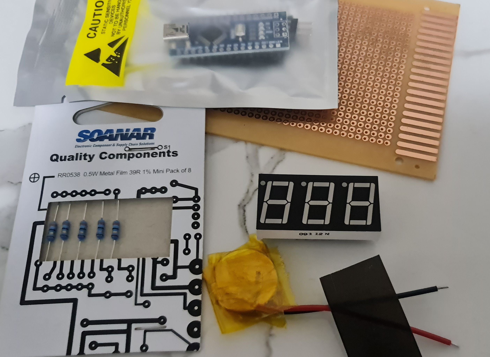
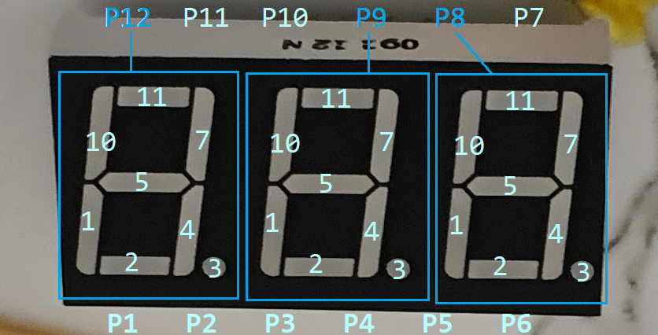

# 🎱 seg display 
## irl pooposting 💩

***Driving an 8-segment display for memes***

I acquired these parts from work (*otherwise headed into the trash*). 
Due to some memery amongst colleagues, **this ensued:**

## Example usage

## Pics!
#### Full frontals

#### Slipshod soldering:

#### stuff

## How to use this project?
I honestly ***don't expect anyone to use this project***
I'm simply showcasing my work here.

This was for some random piece of crap hardware, which the pin layout/wiring may differ for YOUR n-segment displays

8-segment displays are simple devices though so maybe this may actually work for you. Simply remap the pins to your wiring in the code.

## How I made it work
I used a coin battery to figure out which pins do what.

I put some resistors on pins 12,9,8 (block select) to current limit. I started with 330Ω but it was too dim, and reduced it all the way down to 39Ω. 

It could probably run without a resistor, as the power output from the arduino is quite limited, some ESR in the LCDs, etc. The choice of 39Ω had no criteria. I got lazy and didnt want to re-solder resistors too many times, but still wanted some protection, and simply settled on that.

I had to time-multiplex the blocks and messed with timings and duration to get a good balance of brightness and operability. 

## not so FAQ

#### Am I proud of this?

> No. (actually yes)

#### Why *are you* "POO", and the what's with the doge?

IYKYK. 
> I do not support nor condone for any form of disrespect, insensitivity nor acts of hate.
> This work was done in good fun and no one was negatively affected directly nor indirectly as a result of this work
> Use this work responsibly.

#### Is this code any good?

> no. but it worked so yes

## License

[MIT](https://choosealicense.com/licenses/mit/)
